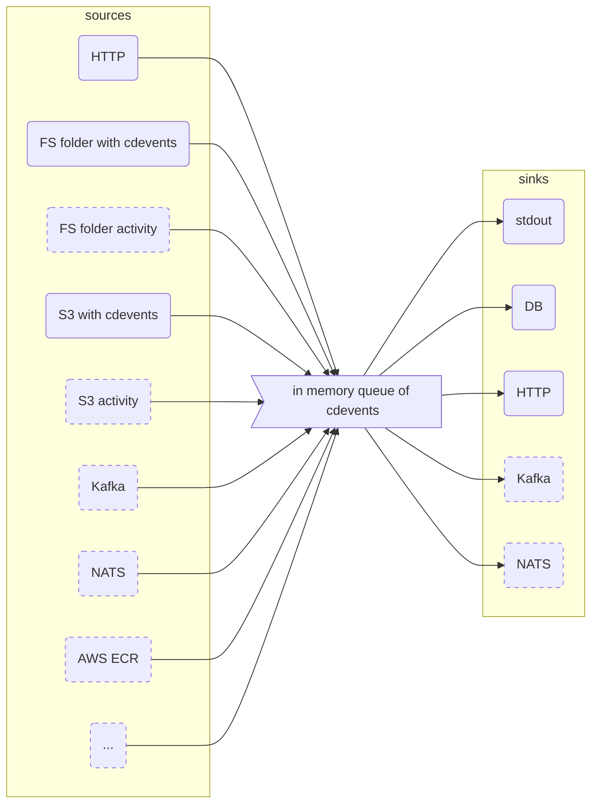

# cdviz

keywords: `cdevents`, `sdlc`
status: wip

A set of components to provide a view of which version of services are deployed and which environment, what test ran,...

- Collect every events ([cdevents]) related to the deployment of artifacts (service, ...), tasks, tests,...
- Dashboard to query and visualize events and states over time

## Architecture Overview

### cdviz-collector

Goals:

- to create cdevents by polling some sources (folder on fs, S3, AWS ECR, ...)
- to receive cdevents from http, kafka, nats
- to send (broadcast) cdevents to various destination database, http, kafka, nats
- to expose some metrics (TBD)

cdviz-collector is configured via a config file + override by environment variables.

### Q&A

Why do dashboard tools, like Grafana, have access (read-only) to the DB (PostgreSQL), and NOT go through an API (micro)service?

- access to the data is the value, not the service
- allow dashboards to use the full query power of SQL to query data, and to plug any analytics tools
- allow Data Ops to split the DB with read-only replicas if needed,...
- no need to create and provide a new custom (and always incomplete, frustrated) query language
  - no need to maintain a custom query language on the service side
  - no need to maintain a connector (`datasource`) for callers (analytics tools,...)
  - no need to re-invent (or to "encapsulate") what DB managers do better
- enforce the read-only view of the DB to be like a public API
  - require to configure access control
  - require to document and expose table structure (like an API) and to provide samples of queries, maybe function,...
- service can provide helper endpoints for some complex queries or additional "views"

### Related projects

Maybe with some overlap:

- [sassoftware/event-provenance-registry: The Event Provenance Registry (EPR) is a service that manages and stores events and tracks event-receivers and event-receiver-groups.](https://github.com/sassoftware/event-provenance-registry)
- [RFC : CDEvents-translator design review by rjalander · Pull Request #42 · cdevents/community](https://github.com/cdevents/community/pull/42)

### Roadmap

- See [ROADMAP.md](ROADMAP.md)
- See [Issues · davidB/cdviz](https://github.com/davidB/cdviz/issues) and use it to discuss features, ideas, bugs,...

[cdevents]: <https://cdevents.dev/>
